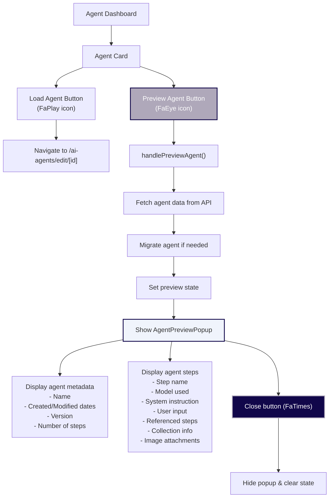

# 🧬 ALMA - Advanced Laboratory Management Assistant

> **A Next.js-powered research assistant platform for document management, AI analysis, and collaborative research workflows.**

[](__tests__/)
[](https://nextjs.org/)
[](https://www.typescriptlang.org/)
[](https://jestjs.io/)

Repository navigation: [Documentation](docs/README.md) | [Scripts and API tests](scripts/README.md).

---

## 📋 Table of Contents

1. [🎯 Project Overview](#-project-overview)
2. [🧪 Testing](#-testing)
3. [🚀 Quick Start](#-quick-start)
4. [📚 Development Guide](#-development-guide)
5. [Python API](#python-api)

---

## 🎯 Project Overview

**ALMA** is a comprehensive research management platform that combines:

- **📄 Document Processing** - OCR, PDF analysis, content extraction
- **🤖 AI-Powered Analysis** - Multi-model AI integration (Gemini, OpenAI, Claude)
- **🔬 Research Tools** - PubMed, OpenAlex, Google Scholar integration
- **👥 Collaboration** - Multi-user project management with sharing
- **🗂️ Smart Organization** - Auto-categorized file management with 28 folder types
- **⚡ Agent Chains** - Automated multi-step AI workflows

### **Target Users:**

- Research scientists and academics
- Laboratory personnel
- Data analysts and researchers
- Teams requiring collaborative document analysis

---

## Python API

The [Python API runbook](docs/api/PYTHON_API_RUNBOOK.md) covers secure authentication,
Google credential renewal, local/hosted commands, shared-project and agent examples,
the complete fictional 272 trial, QC results, created resources and recovery.

Python tools live in [scripts/api/python](scripts/api/python/README.md). The
[API capability reference](docs/api/PYTHON_API_ACCESS.md) and
[portable execution contract](docs/api/AGENT_EXECUTION_API.md) describe the supported
operations. A completed technical workflow is not clinical or regulatory validation.

## 🧪 Testing

### **Test Setup:**

Our project uses **Jest + React Testing Library** following industry standards:

```bash
# Run all tests
npm test

# Run tests in watch mode (development)
npm run test:watch

# Run tests with coverage report
npm run test:coverage
```

### **Test Structure:**

```
__tests__/
├── components/     # React component tests
├── pages/         # Page component tests
├── api/           # API route tests
└── fixtures/      # Test data and mocks
```

### **Quick Test Commands:**

```bash
npm test                    # Run all tests once
npm run test:watch         # Auto-reload tests during development
npm run test:coverage      # Generate coverage report
```

### **Test Configuration:**

- **Jest Config:** `jest.config.js`
- **Setup File:** `jest.setup.js`
- **Mocks:** NextAuth, Google APIs, environment variables

### **Watch Mode Usage:**

When running `npm run test:watch`, you get interactive options:

```
Watch Usage
› Press a to run all tests.
› Press f to run only failed tests.
› Press p to filter by a filename regex pattern.
› Press t to filter by a test name regex pattern.
› Press q to quit watch mode.
› Press Enter to trigger a test run.
```

---

## 🎨 Design System

### **Color Scheme - "Grey Friends"**

ALMA uses a consistent color palette throughout the application:

| Color                                                           | Hex Code  | Usage         | Description                                       |
| --------------------------------------------------------------- | --------- | ------------- | ------------------------------------------------- |
|  | `#11074A` | **Primary**   | Main brand color, buttons, active states, headers |
|  | `#4A4453` | **Secondary** | Text, borders, secondary elements                 |
|  | `#AFA8BA` | **Accent**    | Backgrounds, hover states, subtle accents         |

### **Color Usage Guidelines:**

```css
/* Primary - Use for main actions and branding */
.primary {
  color: #11074a;
}
.primary-bg {
  background-color: #11074a;
}

/* Secondary - Use for text and secondary elements */
.secondary {
  color: #4a4453;
}
.secondary-bg {
  background-color: #4a4453;
}

/* Accent - Use for backgrounds and subtle highlights */
.accent {
  color: #afa8ba;
}
.accent-bg {
  background-color: #afa8ba;
}
```

### **Additional Supporting Colors:**

- **Light backgrounds**: `#F0F4FC`
- **Success**: `#059669`
- **Text gray**: `#6B7280`
- **Borders**: `#E5E7EB`

---

## 🚀 Quick Start

### **Prerequisites:**

```bash
Node.js >= 18.0.0
npm >= 9.0.0
Google Cloud Project with Drive API enabled
```

### **1. Clone & Install:**

```bash
git clone <repository-url>
cd frontend_v3
npm install
```

### **2. Environment Setup:**

Create `.env.local`:

```env
NEXTAUTH_URL=http://localhost:8080
NEXTAUTH_SECRET=your-secret-key
GOOGLE_CLIENT_ID=your-google-client-id
GOOGLE_CLIENT_SECRET=your-google-client-secret
OPENAI_API_KEY=your-openai-key  # Optional
```

### **3. Development Server:**

```bash
npm run dev
```

🌐 **Access:** http://localhost:8080

### **4. Production Build:**

```bash
npm run build
npm start
```

---

## 📚 Development Guide

### **Development Scripts:**

```bash
npm run dev          # Development server (:8080)
npm run build        # Production build
npm run start        # Production server (:8080)
npm run lint         # ESLint checking
npm run test         # Run tests once
npm run test:watch   # Tests in watch mode
npm run test:coverage # Coverage report
```

### **Adding New Components:**

```bash
# Create component file
touch app/components/NewComponent.tsx

# Create test file
touch __tests__/components/NewComponent.test.tsx
```

### **Troubleshooting:**

#### **Port Already in Use:**

```bash
./closeports.sh 8080
# or manually:
lsof -ti :8080 | xargs kill -9
```

#### **Test Issues:**

```bash
npm test -- --clearCache    # Clear test cache
npm test -- --verbose       # Verbose output
```

#### **Docker Build Issues:**

```bash
docker builder prune -af    # Clean Docker cache
```

---

## 🏗️ Architecture

### **Tech Stack:**

```
Frontend:  Next.js 15.1.6 + React 18 + TypeScript + Tailwind CSS
Backend:   Next.js API Routes + Node.js
Database:  Google Drive (file storage) + JSON configs
Auth:      NextAuth.js with Google OAuth
AI APIs:   Google Gemini, OpenAI, Anthropic Claude
Testing:   Jest + React Testing Library
Deployment: Docker + Next.js Production Build
```

### **Key Features:**

- **Document Processing:** OCR with Google Gemini Vision
- **AI Integration:** Multi-model support (Gemini, OpenAI, Claude)
- **Research Tools:** PubMed, OpenAlex, Google Scholar APIs
- **Collaboration:** Multi-user projects with sharing
- **Auto-Organization:** 28 smart folder categories
- **Agent Chains:** Sequential AI workflow processing

### **🤖 Supported AI Models:**

ALMA supports multiple Google Gemini models with different performance characteristics:

| Model                              | ID                     | Performance     | Use Case                                          |
| ---------------------------------- | ---------------------- | --------------- | ------------------------------------------------- |
| **Gemini 3 Pro Preview (Default)** | `gemini-3-pro-preview` | 🚀 Next-Gen     | Advanced reasoning, state-of-the-art capabilities |
| **Gemini 2.5 Pro**                 | `gemini-2.5-pro`       | 🧠 High Quality | Enhanced thinking and multimodal understanding    |
| **Gemini 2.5 Flash**               | `gemini-2.5-flash`     | ⚡ Fast         | Adaptive thinking, fast response                  |

**Default Model:** `gemini-3-pro-preview` (recommended for most use cases)

**Model Selection Available In:**

- 🤖 AI Agent Steps
- 📄 Document Upload & OCR
- 📁 File Manager Analysis
- 🔗 Agent Chains
- 💬 Chat Analysis

### **🎨 3D Cube Animation System:**

ALMA features a sophisticated 3D cube animation system for loading states and visual feedback:

#### **Large Cube Animation:**

- **Location:** AI Agent Create/Edit pages during step execution
- **CSS Classes:** `.big-cube-overlay`, `.big-cube`, `.big-cube-face`
- **Animation:** `@keyframes bigCubeDisassemble` with 3D transforms
- **Colors:** Grey Friends theme with 6 contrasting faces
- **Features:** True 3D perspective, individual face positioning, smooth rotation

#### **Mini Cube Animation:**

- **Location:** AI Enhancement icons on prompt/input fields
- **CSS Classes:** `.small-cube`, `.small-cube-face`, `.small-cube-front/back/right/left/top/bottom`
- **Animation:** `@keyframes trueCube3D` with continuous rotation
- **Colors:** Grey Friends theme (#11074A, #4A4453, #AFA8BA, #6B7280, #E5E7EB, #F97316)
- **Features:** Compact 16px cube, hover effects, seamless transitions

#### **Usage Examples:**

```css
/* Large cube for main loading states */
.big-cube-overlay {
  position: fixed;
  z-index: 9999;
  display: flex;
  align-items: center;
  justify-content: center;
}

/* Mini cube for enhancement icons */
.small-cube {
  width: 16px;
  height: 16px;
  position: relative;
  transform-style: preserve-3d;
  animation: trueCube3D 2s infinite linear;
}
```

#### **Heart-Pulse Loading Animation:**

ALMA features a sophisticated heart-pulse loading animation for agent initialization with sequential checklist progression:

**💓 Animation Specifications:**

- **Location:** Agent Dashboard → Load Agent transition
- **Duration:** 10.5 seconds total (7 steps × 1.5s + delays)
- **Cube Size:** 80px × 80px with 40px translateZ depth
- **Heart Rhythm:** 4-second cycle with double-beat pattern

**🎨 Visual Design:**

- **Background:** Grey Friends gradient overlay with 12px blur
- **Container:** 450px width, glass morphism with subtle border
- **Typography:** System font stack, 2rem title, 1.25rem steps
- **Orange Highlight:** #F97316 for active states with size scaling

**⚙️ CSS Classes & Structure:**

```css
/* Main overlay */
.agent-loading-overlay {
  background: linear-gradient(
    135deg,
    rgba(17, 7, 74, 0.92) 0%,
    rgba(74, 68, 83, 0.88) 50%,
    rgba(175, 168, 186, 0.85) 100%
  );
  backdrop-filter: blur(12px);
}

/* Heart-pulse cube container */
.loading-cube {
  width: 80px;
  height: 80px;
  animation: heartPulseDisassemble 4s ease-in-out infinite;
}

/* Checklist steps */
.loading-step.active .step-text {
  color: #f97316;
  font-size: 1.375rem;
  transform: scale(1.05);
  animation: activeTextPulse 1s ease-in-out infinite;
}
```

**🕐 Heart-Beat Timing Pattern:**

- **0-16%:** First quick pulse (beat 1)
- **24-32%:** Second quick pulse (beat 2)
- **32-40%:** Rest pause
- **55-70%:** Slow opening/disassemble
- **70-85%:** Gradual closing/reassemble
- **85-100%:** Return to rest

**🎯 Face Colors & Positioning:**

- **Front:** #11074A (Primary) - `translateZ(40px)`
- **Back:** #4A4453 (Secondary) - `rotateY(180deg) translateZ(40px)`
- **Right:** #AFA8BA (Accent) - `rotateY(90deg) translateZ(40px)`
- **Left:** #6B7280 (Text Gray) - `rotateY(-90deg) translateZ(40px)`
- **Top:** #E5E7EB (Border) - `rotateX(90deg) translateZ(40px)`
- **Bottom:** #F97316 (Orange) - `rotateX(-90deg) translateZ(40px)`

**📝 Loading Steps Sequence:**

1. "Initializing agent workspace..."
2. "Loading AI neural networks..."
3. "Configuring agent parameters..."
4. "Assembling workflow layers..."
5. "Synchronizing knowledge base..."
6. "Activating agent systems..."
7. "Ready!"

**🎛️ State Management:**

- **Pending:** Grey (#6B7280) indicator, 0.8 opacity text
- **Active:** Orange (#F97316) with pulse + 1.375rem font + scale(1.05)
- **Completed:** Dark grey (#4A4453) with line-through, 0.9 opacity

### **🤖 AI Agent Preview Functionality:**

The AI Agents Dashboard includes a comprehensive preview system that allows users to inspect agent configurations before loading them:



**Preview Features:**

- **👁️ Eye Icon:** Click to preview any agent without loading the full editor
- **📊 Metadata Display:** Shows creation date, version, and step count
- **🔍 Step Breakdown:** Detailed view of each agent step with all configurations
- **🎨 Grey Friends Styling:** Consistent with the application's design system
- **📱 Responsive Design:** Works on all screen sizes

---

## 🔧 Project Structure

### **Auto-Generated Project Folders (28 total):**

#### **📂 Media & Content (9 folders):**

- Images, Created-images, PDFs, Audio, Video, Code, Docs, AF, Others

#### **📂 System & Configuration (3 folders):**

- Config, Logs, Orders

#### **📂 Processing & Analysis (7 folders):**

- Extracts, LatexFullDocs, Analysis, Analysis-output, Reports-output, Incseqdiag-output, Incgraph-output

#### **📂 AI & Automation (4 folders):**

- Agents, Agents-output, Workflows, Prompts

#### **📂 Communication & Data (5 folders):**

- Chats, Scripts, Scripts-output, Collections

---

## 🔑 Authentication & Security

### **Updating Allowed Users:**

1. Edit `app/lib/authOptions.ts`
2. Update the `allowedEmails` array:

```typescript
const allowedEmails = ["user1@example.com", "user2@example.com"];
```

3. Restart the application

---

## 📝 Contributing

1. **Fork** the repository
2. **Create** feature branch: `git checkout -b feature/amazing-feature`
3. **Test** your changes: `npm test`
4. **Commit** changes: `git commit -m 'Add amazing feature'`
5. **Push** to branch: `git push origin feature/amazing-feature`
6. **Open** Pull Request

### **Development Standards:**

- Write tests for new features
- Follow TypeScript strict mode
- Use conventional commits
- Update documentation
- Ensure all tests pass

---

**🚀 ALMA is ready for research acceleration!**

_For questions or support, contact the development team._

---

_Last updated: December 2024_
